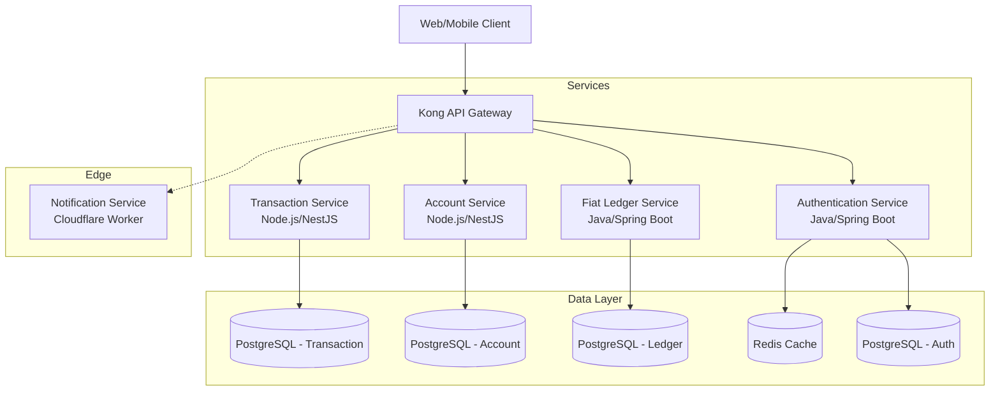

# YatraKulo: Personal Wealth & Asset Management Platform


YatraKulo is a comprehensive, open-source **Personal Wealth & Asset Management Platform**. Designed for individuals who want complete control and visibility over their entire financial portfolio, YatraKulo goes beyond simple expense tracking by offering unified management for fiat currencies, cryptocurrencies, and stock market investments.

## 🌟 Key Features (Current & Upcoming)

- **Secure Authentication:** OAuth2-based secure access and identity management.
- **Fiat Ledger (In Progress):** Robust tracking of daily expenses, incomes, and bank accounts.
- **Asset Portfolios (Upcoming):** Tracking for Cryptocurrency wallets and Stock market holdings.
- **Advanced Reporting (Upcoming):** Automated insights, performance tracking, and exportable financial reports.
- **Enterprise Observability:** Full distributed tracing and central logging using the ELK Stack, OpenTelemetry, and Prometheus.
- **Microservices Architecture:** Highly scalable backend built for reliability and fast iterations.

## 🏗️ High-Level Architecture

YatraKulo is built using a modern, polyglot microservices architecture designed for enterprise-grade scalability and maintainability.



*(See [ARCHITECTURE.md](ARCHITECTURE.md) for a deep dive into our technical design, testing strategies, and observability stack.)*

## 🚀 Getting Started (Local Development)

YatraKulo uses a custom developer CLI built with `Make` to simplify local development across our polyglot stack.

### Prerequisites
- Docker & Docker Compose
- Java 21 & Gradle
- Node.js (20+) & pnpm
- Make

### Quick Start
1. **Start Infrastructure:** Spin up Kong API Gateway, PostgreSQL, and Redis.
   ```bash
   cd infra
   docker-compose up -d
   ```
2. **Run Services:** Use the Makefile from the project root to start services.
   ```bash
   make help              # See all available commands
   make dev-auth          # Start the Authentication Service (Java)
   make dev-ledger        # Start the Ledger Service (Java)
   make dev-account       # Start the Account Service (Node.js)
   ```

## 🗺️ Roadmap
We are actively developing new features to expand YatraKulo into a complete wealth management solution. Check out our [ROADMAP.md](ROADMAP.md) to see what we're working on next!

## 🤝 Contributing
Contributions are what make the open-source community such an amazing place to learn, inspire, and create. Any contributions you make are **greatly appreciated**. 

Please read our [CONTRIBUTING.md](CONTRIBUTING.md) for details on our code of conduct, development process, and pull request guidelines.

## 📄 License
Distributed under the MIT License. See `LICENSE` for more information.
